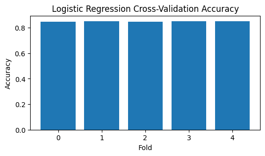
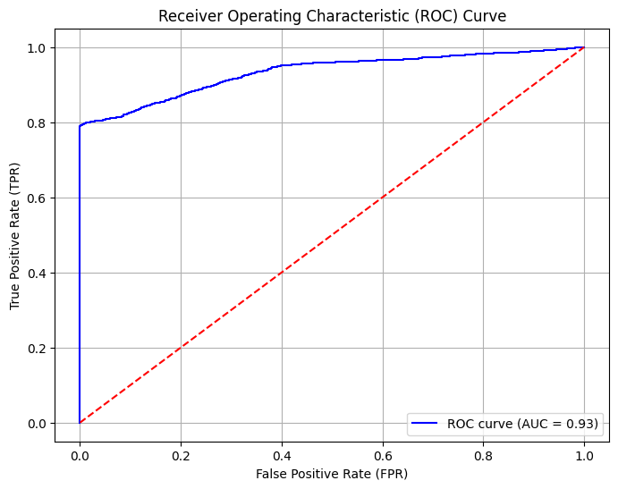

# Account Sharing Detection: A Machine Learning Approach

## Executive Summary

This project showcases the application of advanced machine learning techniques to address a critical business problem: the detection of account sharing. By leveraging Python and its robust ecosystem of data science libraries, we developed a predictive model capable of identifying instances of unauthorized credential sharing. This initiative demonstrates a comprehensive understanding of the machine learning lifecycle, from data preprocessing and feature engineering to model evaluation and optimization. The model's performance, as evidenced by its high accuracy and AUC score, underscores its potential for real-world deployment in enhancing security and revenue protection for subscription-based services.

## Business Problem and Use Case

Unauthorized account sharing poses a significant challenge for SaaS and subscription-based service providers. This practice, driven by cost reduction or task delegation, can lead to substantial revenue loss and heightened cybersecurity risks. Detecting and mitigating account sharing is crucial for maintaining service integrity and protecting intellectual property. 

This project addresses this challenge by developing a machine learning model that analyzes user login patterns and behavioral data to identify instances of potential account sharing. The solution is particularly relevant to industries such as streaming services (e.g., Netflix), online gaming, and enterprise software, where account sharing can directly impact revenue and security.

## Technical Implementation

### Technologies Used

- Programming Language: Python
- Libraries: Pandas, NumPy, Matplotlib, Seaborn, Scikit-Learn

### Project Workflow

1. Exploratory Data Analysis and Feature Engineering: Comprehensive analysis of user login and activity data to identify relevant features.
2. Model Development and Evaluation: Building and evaluating a Logistic Regression model using cross-validation techniques.
3. Performance Optimization: Tuning model hyperparameters to enhance predictive accuracy and robustness.

### Data Preprocessing and Feature Engineering

Data info: user_id, login_time, ip_address, device_type, location, activity_type, activity_period, sharing

```py
# Feature Engineering: Extract logging hour
df['login_hour'] = df['login_time'].dt.hour

# Feature Engineering: Whether on a weekday
df['is_weekday'] = df['login_time'].dt.dayofweek.apply(lambda x: 1 if x < 5 else 0)

# Feature Engineering: Login during working hours
df['is_working_hours'] = df['login_time'].dt.hour.apply(lambda x: 1 if 6 < x < 23 else 0)

# Feature Engineering: Extract activity hour
df["activity_hours"] = df["activity_period"].dt.seconds // 3600

# Feature Engineering: Change on device type
device_change_counts = df.groupby("user_id")["device_type"].nunique().reset_index(name="device_change_count")
df = pd.merge(df, device_change_counts, on="user_id", how="left")

# Feature Engineering: Change on activity type
activity_counts = df.groupby(["user_id", "activity_type"]).size().reset_index(name="activity_count")
df = pd.merge(df, activity_counts, on=["user_id", "activity_type"], how="left")

# Feature Engineering: Change on IP
df["ip_prefix"] = df["ip_address"].apply(lambda x: ".".join(x.split(".")[:2]))
ip_change_counts = df.groupby(["user_id"])["ip_prefix"].nunique().reset_index(name="ip_change_count")
df = pd.merge(df, ip_change_counts, on="user_id", how="left")

# One-Hot Encoding
df = pd.get_dummies(df, columns=['device_type', 'location', 'activity_type'], drop_first=True)

# Drop unnecessary columns
df.drop(columns=['user_id', 'login_time', 'ip_address', 'activity_period'], inplace=True)

df.head()
```

### Model Training and Evaluation

```py
X = df.drop(columns=['sharing'])  # Features
y = df['sharing']  # Target variable

# Split data (80% training, 20% testing)
X_train, X_test, y_train, y_test = train_test_split(X, y, test_size=0.2, random_state=42)

# Define the Logistic Regression model
logreg = LogisticRegression(random_state=42)

# Define the cross-validation strategy (Stratified K-Fold for imbalanced classes)
logreg_scores = cross_val_score(logreg, X, y, cv=5, scoring='accuracy')

print(f"Logistic Regression Cross-Validation Accuracy: {logreg_scores.mean():.4f}")
```

Logistic Regression Cross-Validation Accuracy: 0.8497

```py
# Observe the 5 folds cross-validation scores
cross_val_scores = pd.DataFrame(logreg_scores)

plt.figure(figsize=(6, 3))
plt.bar(cross_val_scores.index, cross_val_scores[0])
plt.xlabel('Fold')
plt.ylabel('Accuracy')
plt.title('Logistic Regression Cross-Validation Accuracy')
```


### Model Training and Prediction

```py
# Step 1: Train a Logistic Regression model
logreg = LogisticRegression(random_state=42, max_iter=1000)
logreg.fit(X_train, y_train)

# Step 2: Predict on the test set
y_pred_logreg = logreg.predict(X_test)

# Step 3: Evaluate the Logistic Regression model
logreg_accuracy = accuracy_score(y_test, y_pred_logreg)
logreg_report = classification_report(y_test, y_pred_logreg)
logreg_confusion_matrix = confusion_matrix(y_test, y_pred_logreg)
```

## Model Performance and Results

### Accuracy

0.84575

### Confusion Matrix


### Classification Report
|              | precision | recall | f1-score | support |
|--------------|-----------|--------|----------|---------|
| 0            | 0.84      | 0.61   | 0.70     | 1210    |
| 1            | 0.85      | 0.95   | 0.90     | 2790    |
| -            | -         | -      | -        | -       |
| accuracy     |           |        | 0.85     | 4000    |
| macro avg    | 0.84      | 0.78   | 0.80     | 4000    |
| weighted avg | 0.85      | 0.85   | 0.84     | 4000    |

### Receiver Operating Characteristic (ROC) Curve



## Performance Optimization

Initial Model Accuracy (without tuning): 0.8265
Final Model Accuracy (after tuning): 0.8532
Accuracy Improvement: 0.0267

Hyperparameter tuning was performed using GridSearchCV, refining decision tree parameters to enhance classification accuracy. The best parameters optimized model performance, improving accuracy from 0.8265 to 0.8532.

```py
from sklearn.model_selection import GridSearchCV

# Step1: Build an initial model (not tuned)
initial_tree = DecisionTreeClassifier(random_state=42)
initial_tree.fit(X_train, y_train)

# Evaluate the initial model on the test set to get a baseline performance
y_pred_initial = initial_tree.predict(X_test)
initial_accuracy = accuracy_score(y_test, y_pred_initial)
print(f"Initial Model Accuracy (without tuning): {initial_accuracy:.4f}")

# Step 2: Hyperparameter Tuning using GridSearchCV (on the training set only)
# Define the parameter grid to search over
param_grid = {
    'max_depth': [2, 4, 6, 8, 10],
    'min_samples_split': [2, 5, 10],
    'min_samples_leaf': [1, 5, 10],
    'criterion': ['gini', 'entropy']
}

# Initialize GridSearchCV with a DecisionTreeClassifier
grid_search = GridSearchCV(estimator=DecisionTreeClassifier(random_state=42),
                           param_grid=param_grid,
                           cv=5,  # 5-fold cross-validation
                           scoring='accuracy',
                           n_jobs=-1,  # Use all available cores
                           verbose=1)  # Print progress

# Fit GridSearchCV (only on the training set)
grid_search.fit(X_train, y_train)

# Get the best parameters and train the final model
print(f"Best Parameters from GridSearch: {grid_search.best_params_}")
best_tree = grid_search.best_estimator_  # Retrieve the best model

# Step 3: Evaluate the final model on the test set
y_pred_final = best_tree.predict(X_test)
final_accuracy = accuracy_score(y_test, y_pred_final)
print(f"Final Model Accuracy (after tuning): {final_accuracy:.4f}")

# Compare initial and final performance
print(f"Accuracy Improvement: {final_accuracy - initial_accuracy:.4f}")
```

## Conclusion and Business Implications

The developed machine learning model effectively identifies instances of account sharing with a high degree of accuracy and reliability. This solution offers significant business value by:

- Revenue Protection: Detecting and mitigating account sharing helps safeguard subscription revenue.
- Enhanced Security: Identifying suspicious access patterns strengthens cybersecurity measures.
- Improved User Experience: Ensuring fair usage policies maintain service integrity for legitimate users.

Future work may include exploring more advanced machine learning algorithms and incorporating additional data sources to further improve model performance.

## Reference
- [How Netflix's crackdown on password sharing could use analytics](https://community.jmp.com/t5/JMP-Blog/How-Netflix-s-crackdown-on-password-sharing-could-use-analytics/ba-p/368599?trMode=source)
- [Why do employees share passwords at work? | SurveyMonkey](https://www.surveymonkey.com/curiosity/why-people-share-passwords-with-coworkers/)
